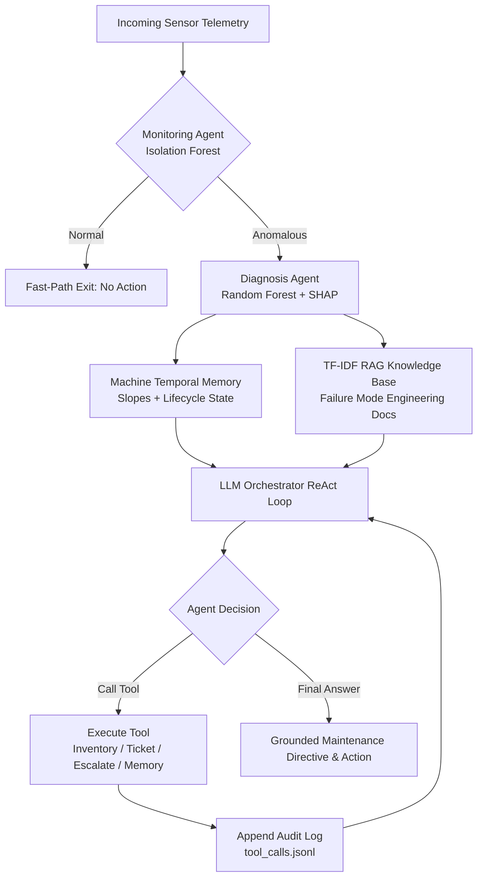

# Agent Architecture

## Baseline Flow (Rule-Based)
1. Monitoring Agent — checks incoming sensor row for anomalies (Isolation Forest)
2. Diagnosis Agent — if anomalous, predicts failure probability + explains why (Random Forest + SHAP)
3. Recommendation Agent — converts diagnosis into a maintenance action via fixed if/else heuristics
4. Orchestrator — runs the above in sequence for each incoming row

## Data Flow (Baseline)
```text
sensor_row (dict) 
  → monitoring_agent(row) → is_anomaly (bool)
  → diagnosis_agent(row) → {prediction, confidence, explanation}
  → recommendation_agent(diagnosis) → {action, urgency}
```

---

## Agentic AI Layer Architecture

To evolve from static if/else heuristics to a genuine autonomous AI system, the **Agentic AI Layer** replaces the deterministic recommendation step with a multi-turn **ReAct (Reasoning + Acting)** autonomous agent loop grounded in domain physics knowledge, temporal degradation memory, and real operational tools.



### 1. The ReAct (Reasoning + Acting) Autonomous Loop
Unlike static pipelines that immediately output fixed text from `diagnosis["confidence"]`, the LLM orchestrator executes an iterative dialogue loop:
- **System Prompt**: Equips the agent with its industrial role, JSON-based tool schemas, verified AI4I domain formulas, current telemetry, SHAP attributions, and temporal trajectory slopes.
- **Strict Output Contract**: Each turn, the LLM emits a single JSON object:
  - `{"action": "call_tool", "tool": "...", "args": {...}, "reasoning": "..."}`
  - `{"action": "final_answer", "summary": "...", "reasoning": "..."}`
- **Execution & Feedback**: Tools are executed in `tools.py`, and observation outputs are injected back into the LLM conversation context until the agent decides its investigation is complete (or hits the 5-iteration cap).
- **Resilience Strategy**: Malformed JSON from small local models (e.g. 3B parameters) is caught and reprompted. If repeated failures occur, the orchestrator triggers a safe fallback calling `escalate_to_engineer` rather than crashing the pipeline.

### 2. RAG Knowledge Base & Physics Formula Grounding
Grounding the LLM in verified engineering thresholds eliminates hallucinations and ensures recommendations align with real mechanical physics:
- **TF-IDF + Cosine Similarity**: With 5 focused domain documents (`twf`, `hdf`, `pwf`, `osf`, `rnf`), TF-IDF provides sub-millisecond in-memory retrieval, zero external API costs, and exact token matching on domain engineering units (`min·Nm`, `K`, `W`, `RPM`).
- **Verified AI4I 2020 Failure Formulas**:
  - **Tool Wear Failure (TWF)**: Cumulative tool wear in the 200–240 min window ($200 \le \text{ToolWear} \le 240\text{ min}$).
  - **Heat Dissipation Failure (HDF)**: $\Delta T = (\text{Process Temp} - \text{Air Temp}) < 8.6\text{ K}$ AND $\text{Rotational Speed} < 1380\text{ RPM}$.
  - **Power Failure (PWF)**: $P = \text{Torque [Nm]} \times \text{RPM} \times \frac{2\pi}{60}$; fails if $P < 3500\text{ W}$ or $P > 9000\text{ W}$.
  - **Overstrain Failure (OSF)**: $\text{Tool Wear [min]} \times \text{Torque [Nm]}$ exceeds $11,000$ (Type L), $12,000$ (Type M), or $13,000$ (Type H).
  - **Random Failure (RNF)**: Flat $0.1\%$ stochastic probability uncorrelated with any sensor readings.

### 3. Machine Temporal Memory & Trajectory
AI4I sensor rows do not provide repeating machine IDs, so consecutive rows represent a proxy timeline for a continuous machining line:
- **Rolling Window**: `MachineMemory` maintains a `deque(maxlen=20)` buffer.
- **Lifecycle Detection**: When `Tool wear [min]` drops by $>50\text{ min}$ between consecutive readings, a physical tool insert swap is detected and the memory buffer resets for a fresh lifecycle.
- **Slope & Extrapolation**: Linear regression computes $\frac{d(\text{Wear})}{dt}$ and $\frac{d(\text{Torque})}{dt}$, extrapolating the estimated readings remaining until reaching the critical 200 min TWF danger zone.

### 4. Domain Tool Ecosystem & Persistent Audit Logging
The agent possesses real tools for autonomous actions:
- `create_maintenance_ticket(machine_id, urgency, notes)`: Dispatches official work orders to the plant CMMS.
- `check_spare_parts_inventory(part_type)`: Verifies warehouse stock levels, part numbers, and lead times.
- `escalate_to_engineer(machine_id, reason)`: Dispatches Tier-2 engineering notifications for ambiguous/safety-critical events.
- `request_more_sensor_data(machine_id)`: Queries temporal memory when a single reading is inconclusive.
- **Audit Trail**: Every tool invocation is permanently recorded to `data/agent_logs/tool_calls.jsonl` with ISO UTC timestamps, arguments, and execution results.

---

## Anomaly Detection Tuning
Isolation Forest trained on raw sensor features + engineered interaction 
features (Temp_Diff, Power) to capture combined effects like high torque + 
high tool wear that raw features alone miss.

Contamination tuned via failure-recall analysis (tested 0.05 to 0.25):
- 0.05: 31.9% recall, 5% flagged
- 0.15: 55.5% recall, 15% flagged  ← chosen
- 0.25: 71.1% recall, 25% flagged

Chose 0.15 to balance catching real failures against flooding the system 
with false alarms — flagging 1 in 4 rows (as at 0.25) would make "anomalous" 
a meaningless signal in the live demo.

## Model Tuning Decisions
Tested SMOTE oversampling via 5-fold cross-validation vs class_weight="balanced":
- class_weight="balanced" (chosen): 94% precision, 74% recall
- SMOTE: 51% precision, 80% recall
Kept class_weight approach — a 6pt recall gain wasn't worth nearly halving 
precision, which would cause alert fatigue in a real deployment.

## Threshold Tuning
Tested classification thresholds 0.3-0.7 on the failure probability output:
- 0.5 (default): 94.4% precision, 75.0% recall, F1=0.836
- 0.4 (chosen): 91.8% precision, 82.4% recall, F1=0.868
Chose 0.4 — best F1 score, and a meaningful recall gain (+7.4pts) for only 
a small precision cost, without SMOTE's much larger precision trade-off.

## Algorithm Comparison
Compared Random Forest (chosen) against XGBoost on the same train/test split:
- Random Forest (threshold=0.4): 91.8% precision, 82.4% recall, F1=0.868
- XGBoost (threshold=0.5): 84.6% precision, 80.9% recall, F1=0.827, ROC-AUC=0.986

XGBoost had a slightly better ROC-AUC (better class separation overall) but 
Random Forest gave a better F1 at our chosen operating threshold — kept 
Random Forest as the production model.

## Hyperparameter Tuning
Ran GridSearchCV (81 combinations, 5-fold CV) on Random Forest hyperparameters.
Best found: max_depth=None, min_samples_leaf=4, min_samples_split=2, n_estimators=200
— cross-validated F1=0.826, but on the held-out test set (default threshold):
precision=84.9%, recall=82.4%, F1=0.836.

This did NOT beat our original model combined with the tuned 0.4 classification
threshold (precision=91.8%, recall=82.4%, F1=0.868). Kept the original model —
threshold tuning provided a bigger, cheaper improvement than hyperparameter
search in this case.

## Full Model Comparison (Fair, Threshold-Swept)
Tested 3 models across 5 classification thresholds each (15 combinations total):

| Model | Best Threshold | Precision | Recall | F1 |
|---|---|---|---|---|
| Random Forest (chosen) | 0.4 | 91.8% | 82.4% | 0.868 |
| XGBoost | 0.6 | 85.9% | 80.9% | 0.833 |
| Grid-Searched Random Forest | 0.5 | 84.8% | 82.4% | 0.836 |

Original Random Forest with a tuned threshold outperformed both a different 
algorithm (XGBoost) and a hyperparameter-optimized version of itself — 
confirming it as the genuinely best choice, not just the first one tried.

## Anomaly Detection Algorithm Comparison
Compared Isolation Forest against Local Outlier Factor (LOF) and an ensemble
of both, across contamination levels 0.05-0.25:
- Isolation Forest alone (chosen, contamination=0.15): 55.5% recall, 15% flagged
- LOF alone: consistently worse than Isolation Forest at every contamination
  level tested (e.g. 34.5% recall at contamination=0.15)
- Ensemble (either model flags): 65.8% recall, but 26.3% of all rows flagged

Kept Isolation Forest alone — the ensemble's recall gain didn't justify
nearly doubling the false-alarm rate.

## Feature Importance
Random Forest's built-in feature importance confirms our SHAP explanations:
Power (24.5%), Rotational Speed (19.7%), and Torque (19.2%) are the top three
drivers of failure predictions — consistent across two independent
explainability methods (global importance and per-row SHAP).